# what is machine learning

## Recherches et documentation

0. [Lexique](#Lexique)
1. [Science des données](#science-des-données)
2. [Apprentissage automatique ](#apprentissage-automatique)
3. [Apprentissage supervisé](#apprentissage-supervisé)
4. [Apprentissage non supervisé](#apprentissage-non-supervisé)
5. [Classification supervisée](#classification-supervisée)
6. [Classification non supervisée](#classification-non-supervisée)
7. [Données d'entraînement, de test, de validation](#données-dentraînement-de-test-de-validation)
8. [Validation croisée](#validation-croisée)
9. [Corrélation linéaire (de pearson) entre deux variables](#corrélation-linéaire-de-pearson-entre-deux-variables)
10. [Fonction de coût](#fonction-de-coût)
11. [Régression](#regression)
12. [Descente de gradient](#descente-de-gradient)
13. [Apprentissage profond](#apprentissage-profond)

## Sources

   - **Machine learning avec Scikit-Learn**
   Aurélien Géron, editions Dunod O'reilly
   2017
   - **Machine learning : les fondamentaux**  *Exploiter des données structurées en Python*
   Harrison Matt, éditions O'Reilly Media
   2020
   - [StatQuest](https://statquest.org/video-index/) et sa [chaîne youtube](https://www.youtube.com/watch?v=fSytzGwwBVw&list=PLblh5JKOoLUICTaGLRoHQDuF_7q2GfuJF&index=3)
   - [MachineLearnia](https://www.machinelearnia.com/) et sa [chaîne youtube](https://www.youtube.com/@MachineLearnia)
   - [Datatab.fr](https://datatab.fr/tutorial/regression)
   - [Université d'Angers](math.univ-angers.fr/labatte/enseignement/master/classificationsupervisee.pdf)
   - [IBM](https://www.ibm.com/fr-fr/topics/machine-learning)
   - [CNIL](https://www.cnil.fr/fr/definition/apprentissage-automatique)
   - [ekinox.io](https://blog.ekinox.io/ml/normalisation-series-temporelles)
   - [wikipedia](https://fr.wikipedia.org/wiki/Apprentissage_automatique)

## Lexique :

|||
|:--------------------|:--|
|**attribut**| type de donnée ( ex : *kilométrage* )|
|**caractéristique** Feature  **variable explicative**| un attribut **et** sa valeur ( ex : *kilométrage = 58 000 km )*|
|**variable à expliquer** Target| étiquette|
|**variable qualitative**|Aussi appelé **variable catégorielle** Ne peut prendre qu'un nombre fini de valeurs, appelées **modalitées** |
|**intercept**   **$\theta_0 $**   **terme constant**|dans une équation de régression linéaire   valeur de la variable à expliquer lorsque toutes les variables explicatives sont égales à zéro.   Point d'intersection avec l'axe des ordonnées.|
|**biais**| synonyme d'intercept dans les modèles de régression.  Représente l'ajustement constant nécessaire pour mieux prédire la variable à expliquer, indépendamment des variables explicatives.  Dans un modèle d'apprentissage automatique, c'est la valeur qui est ajoutée avant d'appliquer les coefficients aux variables explicatives.|
|**hyperparamètre**|paramètre de l'algorithme d'apprentissage (et non du modèle) Permet de contrôler le niveau de **régularisation** durant l'apprentissage (il doit être défini avant, et rester constant)|

**Intercept et biais** sont souvent utilisés de manière interchangeable, en particulier dans le contexte de modèles de régression, où le biais ajuste la sortie avant d'appliquer les coefficients aux variables explicatives.

[Retour à l'index](#recherche-et-documentation)

## Science des données
Ou comment générer du sens à partir de données - *Faire parler les données*.

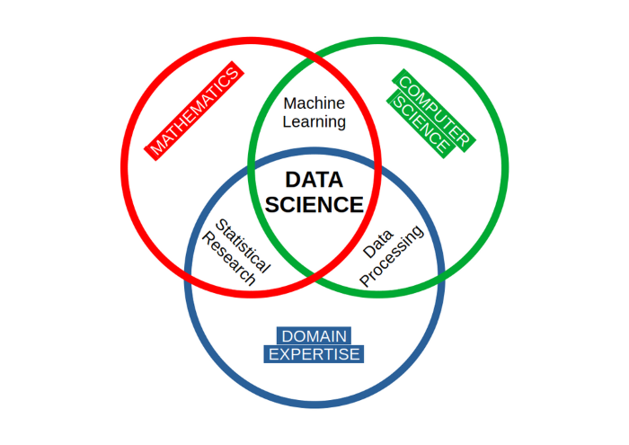

Considérée comme un nom alternatif pour les statistiques dans les années 60, la science des données devient une discipline à part entière à la fin des années 90 avec le boom de l'informatique. 
 
Elle s'articule autour de la donnée :

- conception.
- collecte.
- analyse.

L'objet de cette science est l'étude et l'analyse des données afin d'en extraire des informations pertinentes pour les entreprises.

Elle adopte une approche pluridisciplinaire, mêlant des concepts et des méthodes issus des **mathématiques**, des **statistiques**, de l'**intelligence artificielle** et de l'**informatique**.

L'objectif est d'examiner de vastes ensembles de données pour répondre à des questions clés telles que :
- Que s'est-il passé ?
- Pourquoi cela s'est-il produit ?
- Que va-t-il se passer ?
- Quelles actions peut-on entreprendre sur la base de ces résultats ?

4 formes d'analyse principale se dégagent :
1. **Analyse descriptive**
visualisation de données
2. **Analyse diagnostique**
exploration, transformation, corrélation...
3. **Analyse prédictive**
machine learning, la prédiction, la comparaison de modèles et la modélisation prédictive.
4. **Analyse prescriptive**
suite logique et proactive de l'analyse prédictive
 

[Retour à l'index](#recherche-et-documentation)
 

## Apprentissage automatique
L'art de programmer des ordinateurs de sorte qu'ils puissent apprendre à partir de données

On considère qu'un ordinateur "apprend" s'il améliore sa **[performance](#fonction-de-coût)** lors de l'exécution d'une **tâche** au fur et à mesure de son **expérience**.

### Il existe 2 grandes familles d'apprentissage automatique :
#### La classification - prédire des classes
Prédire une catégorie ou une étiquette à partir des caractéristiques des données d'entrée.

**exemple :**  filtre de spam à partir d'e-mail accompagnés de leur classe (normal/spam) 

#### La régression - prédire des valeurs
Prédit une valeur numérique **cible (target)** à partir des valeurs **caractéristiques (feature)** d'attributs ou de variables d'une observation

**exemple :** prédire le prix d'une voiture en fonction de son age, de son kilométrage, etc...

### Mode de généralisation
On peut aussi catégoriser les système de machine learning selon leur mode de généralisation  :
Apprentissage à partir d'observation - **Instance based learning**  Le système généralise à de nouveaux cas en utilisant une mesure de similarité

Apprentissage à partir d'un modèle  
Construit un modèle à partir des exemples.
Ce modèle est ensuite utilisé pour les prédictions

## Apprentissage supervisé
Les données d'entrainement fournies à l'algorithme comportent des **étiquettes** qui indiquent le résultat voulu.
Les données sont caractérisé par des variables X (**features**), et annoté d'une variable y (**label/target**)

  

L'objectif de l'algorithme est d'apprendre à faire correspondre les entrées aux sorties afin de pouvoir prédire l'étiquette correcte pour de nouvelles données jamais vues.

  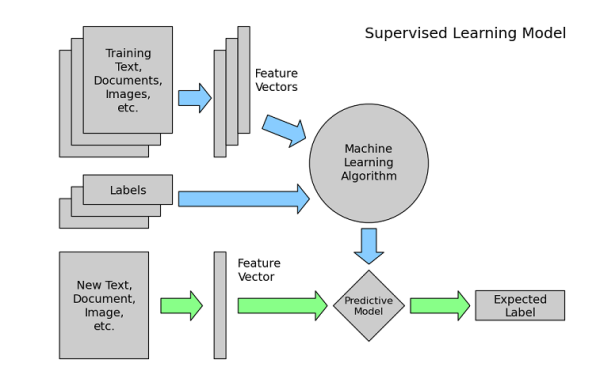

[Retour à l'index](#recherche-et-documentation)

## Apprentissage non supervisé
Les données d'entrainement ne comportent **pas d'étiquettes**.
L'algorithme n'a donc pas d'informations sur le résultat attendu.
Il explore les données pour y découvrir des structures, des motifs ou des relations cachées sans qu'une sortie spécifique ne lui soit fournie.
Il tente d'organiser les données selon leurs similarités ou différences.

|                 | Apprentissage supervisé            | Apprentissage non supervisé           |
|-----------------------|------------------------------------|--------------------------------------|
| Données               | Étiquetées                         | Non étiquetées                      |
| Objectif              | Prédire une sortie                 | Découvrir des structures            |
| Types de problèmes    | Classification, régression         | Clustering, réduction de dimensionnalité |
| Exemples typiques     | Détection de spam, prévision des ventes | Segmentation de clients, détection d'anomalies |

[Retour à l'index](#recherche-et-documentation)
 

## Classification / Régression

### Classification

Prédiction d'une variable  **qualitative/discrète** 
 
### Regression
 
Prédiction d'une variable **quantitative/continue**

## Classification supervisée

- **On dispose d'observations déjà classés**
- **On veut classer une nouvelle observation, lui attribuer une étiquette**

La classification supervisée repose sur des algorithmes qui apprennent, à partir d’un ensemble de données d’entraînement étiquetées, à associer chaque nouvelle observation à l’une des catégories définies.

  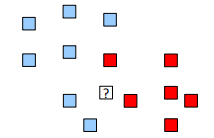

Le modèle identifie des motifs et des relations entre les variables explicatives (features) et les classes cibles, puis il formalise ces relations sous forme de règles de décision.

Ces règles permettent ainsi de classer automatiquement de nouvelles observations en se basant sur leurs caractéristiques.

**Exemple :** un modèle de classification des emails peut apprendre que la présence de certains mots-clés, la fréquence d’envoi ou l’adresse de l’expéditeur sont des critères pertinents pour distinguer un spam d’un email légitime.

 

[Retour à l'index](#recherche-et-documentation)

 

## Classification non supervisée

La classification non supervisée est une technique d'apprentissage automatique utilisée lorsque les données ne sont pas accompagnées de labels ou d'étiquettes préexistantes.

L'objectif est d'**identifier des structures** cachées **ou des regroupements naturels** dans les données.

1. On dispose d'**éléments non classés**
   les mots d'un texte ou les clients d'un site e-commerce sans information préalable sur leurs catégories.
 

2. On cherche à les **regrouper en classes en se basant sur leurs similitudes**
  par exemple :
    - les mots ayant des contextes d'utilisation proches
    - les clients ayant des comportements d'achat similaires.
 

3. Si l'algorithme attribue la même étiquette à plusieurs éléments.
   Ils sont supposés être en rapport avec une même thématique ou un même comportement, formant ainsi des clusters (groupes).

| 1 | 2 | 3 |
|--------|---------------|----------------|
|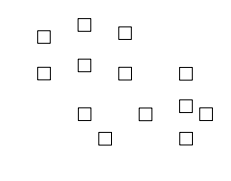|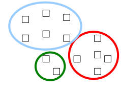|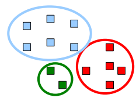|

**Exemples courants :**
- Regrouper des articles de presse selon leurs sujets (politique, sport, technologie...).
- Segmenter une clientèle selon ses habitudes d'achat pour du marketing ciblé.
 

[Retour à l'index](#recherche-et-documentation)
 

## Données d'entraînement, de test, de validation

Après les phases de collecte, de nettoyage et de préparation des données :
- recherche de correlations entre les variables
- gestion des variables quantitative (stratification, normalisation, ...)
- gestion des variables qualitative (encodage, onehot encoding, ...)
- combinaison de variables (création de nouvelles caractéristiques, feature engineering).

Vient la phase de l'**entrainement du modèle**.
supervisé ou non supervisé selon que les données contiennent ou non des étiquettes (labels)
Il permet d'ajuster le modèle choisi aux données dans le but de faire des prédictions ou de la classification sur de nouvelles données

### Entrainement

Entrainer un modèle consiste à définir ses paramètres de telle sorte qu'ils s'ajustent au mieux au jeu d'entrainement

La [Fonction de coût](#fonction-de-coût) permet de mesurer si le modèle s'ajuste bien aux donnée d'entrainement (ou pas).
Pour un modèle de **Regression** les fonctions de coût usuelles sont :
- **RMSE** racine carrée des erreurs quadratique moyenne -(root mean square error)
- **MSE** erreur quadratique moyenne - (mean square error)

Pour entrainer un modèle de régression linéaire, il faut trouver le vecteur $\theta$ qui minimise la fonction de coût.

#### Entrainement - Méthode analytique
Calcul les valeurs des paramètres du modèle qui donnent le meilleur résultat sur le jeu d'entrainement
(qui minimise la fonction de coût)

#### Entrainement - Descente de gradient
ou *Gradient Descent* en anglais 
Optimisation itérative qui modifie graduellement les paramètres du modèle pour minimiser la fonction de coût sur le jeu d'entrainement 
**Converge au final vers le même jeu de paramètres que la méthode analytique** ou une approximation du minimum global si le modèle n'est pas convexe.

### validation
L'objectif est d'ajuster et d'optimiser le modèle. 
On utilise un jeu de validation distinct du jeu d'entrainement (validation simple) ou la cross validation

- Optimisation des hyperparamètres du modèle pour améliorer ses performances.
- détecter d'éventuels problèmes
- Détecter le surajustement : un modèle trop complexe mémorise les données au lieu d'apprendre leurs tendances.
- Détecter le sous-ajustement : un modèle trop simple passe à côté des structures importantes.
- Optimiser les performances : tester différentes configurations pour maximiser les résultats.
- Généralisation : le jeu de validation permet d'estimer comment le modèle se comportera sur des données réelles et non vues auparavant.

#### Surajustement
**Overfitting** : le modèle apprend trop bien les détails et le bruit des données d'entraînement, ce qui nuit à sa capacité à généraliser. 
Solutions possible :
- simplifier le modèle, moins de paramètres
- réduire le nombre d'attributs des données d"entrainement
- imposer des contraintes au modèle avec un hyperparamètre (**régularisation**)
- utiliser plus de données d'apprentissage
- réduire le bruit des données (supprimer les données abérantes, les erreurs)

#### Sous-ajustement
**Underfitting** : le modèle est trop simple et ne capte pas la structure sous-jacente des données. 
Solutions possible :
- Choisir un modèle plus puissant, avec plus de paramètres
- Fournir de meilleurs variables à l'algorithme d'apprentissage
- réduire les contraintes sur le modèle (hyperparamètre de régularisation)

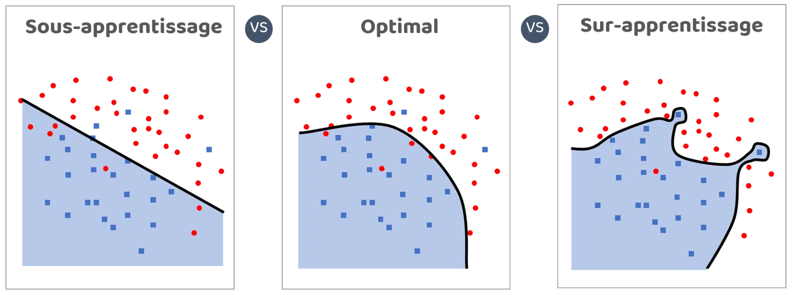

### test
La phase de test est l'étape finale, elle consiste à évaluer les performances du modèle sur un jeu de données qui n'a pas été utilisé pendant l'entraînement ou la validation. 
Le jeu de test ne doit jamais être utilisé pour ajuster le modèle. Il sert uniquement à mesurer sa performance finale.
Cela permet d'obtenir une estimation objective de la capacité du modèle à généraliser ses prédictions sur de nouvelles données.

**Évaluation des performances :**
On compare les prédictions du modèle avec les valeurs du jeu de test.

**Métriques courantes pour évaluer les performances :**
**classification**
- Précision (Accuracy) : proportion de prédictions correctes.
- Rappel (Recall) : capacité du modèle à identifier les éléments positifs.
- F1-score : moyenne harmonique entre la précision et le rappel.
**régression**
- Erreur quadratique moyenne (MSE).
- RMSE.
- R² (coefficient de détermination).

**Importance du test :**
- Identifier les biais et faiblesses du modèle 
- Vérifier sa capacité à généraliser.

Une fois le modèle testé, on ne le modifie plus.

 

[Retour à l'index](#recherche-et-documentation)
 

Dans un projet de Machine Learnig, il faut séparer les données :

1. Jeu d'entrainement pour ajuster le modèle aux données. Essayer d'avoir l'erreur d'apprentissage la plus faible possible en comparant plusieurs modèles avec différent hyperparamètrees

2. Jeu de test pour évaluer les performances du modèle entrainé.
Connaitre l'erreur de généralisation des différents modèles précedement entrainés

3. Jeu de validation pour faire un test final avec le meilleur modèle et les meilleurs hyperparamètres.

 
Ces trois étapes – **entraînement**, **test** et **validation** – sont essentielles pour garantir que le modèle est fiable et performant avant son déploiement.
 
 
Il est courant d'avoir recours à la technique de la [Validation croisée](#validation_croisee) pour éviter de gaspiller des données d'entrainement dans le jeu de validation :
- le jeu d'entrainement est partagé en sous-ensembles
- chaque modèle est entrainé sur une combinaison différente de sous-ensembles
- chaque modèle est validé sur le sous-ensemble restant
- Le modèle sélectionné est entrainé sur l'ensemble du jeu d'entrainement
- il est testé sur le jeu de testé pour mesurer l'erreur de généralisation.c

## Validation croisée
Dans un projet de Machine Learnig, il faut séparer les données :

- un Jeu de données pour **entrainer** le modèle 
- un Jeu de données pour **tester** le modèle entrainé
- un dernier Jeu pour **valider** le modèle sur de nouvelles données

**La validation croisée**
Consiste en l'utilisation alternative et conjointe des Jeu d'entrainement et de test.
Cela implique d'entrainer/tester le modèle plusieurs fois :

1. division du Jeu de donné en K sous-ensembles
 
2. entrainement puis évaluation du modèle K fois
    - en changeant de combinaison Jeu d'entrainement / Jeu d'évaluation à chaque itération
 
3. compare les résultats obtenus
 

Ainsi, toutes les tranches de donnée sont alternativement réservèes aux test.
Au final, toutes les données ont servies à l'entrainement et au test.
Cela permet d'obtenir une estimation plus stable des performances.
Nécessite l'utilisation d'une [fonction de fitness](#fonction-de-coût)

#### Validation croisée avec un dataset divisé en 4 sous ensemble :

|itération | entrainement | test| résultats|
|:------:|:-------------:|:--------------:|:---------------:|
|**1**|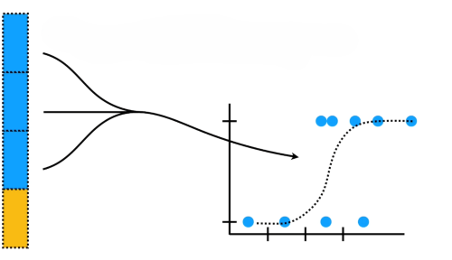tranches 2, 3 et 4|  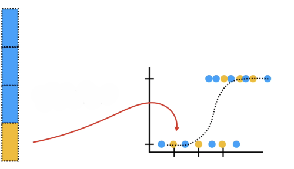tranche 1|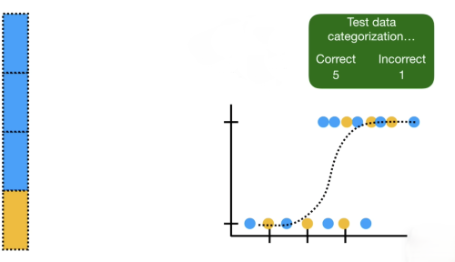|
|**2** | tranches 1, 3 et 4|tranche 2|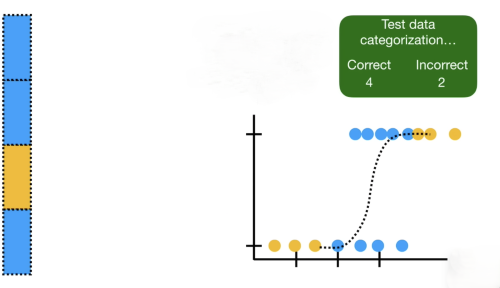|
|**3** | tranches 1, 2 et 4|tranche 3|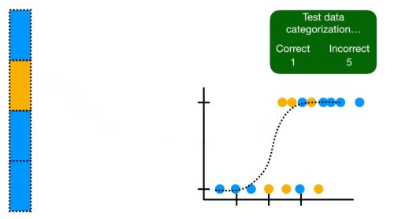|
|**4** | tranches 1, 2 et 3|tranche 4|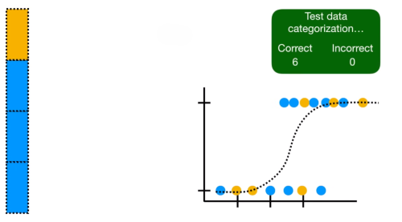|

L'idéal étant de faire une **validation croisée avec différent modèles** afin de les comparer :
- Logistic regression
- support vector machines
- k-nearest neighbors
- etc...

  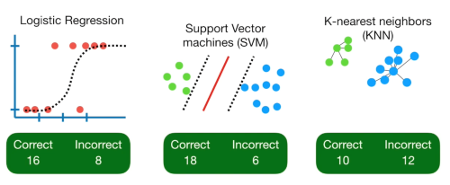

[Retour à l'index](#recherche-et-documentation)

## Corrélation linéaire (de Pearson) entre deux variables

La corrélation linéaire de Pearson mesure l'intensité et le sens de la relation linéaire entre deux variables quantitatives.

Elle est définie par un coefficient, noté **r**, avec une **valeur comprise entre -1 et 1 :**
| coefficient r|correlation|signification|
|:--:|:-------:|-----|
|**1**| positive forte| si une des variables augmente, l'autre augmente pareillement|
|**0.3**| positive faible| si une des variables augmente, l'autre augmente moins|
|**0**|Aucune corrélation linéaire| les variables ne présentent pas de relation linéaire claire|
|**- 1**| négative forte| si une des variables augmente, l'autre diminue pareillement|
|**- 0.3**| négative faible| si une des variables augmente, l'autre diminue moins|

[Formule du coefficient de Pearson](formules.md#coefficient-de-pearson)

 

**Ci dessous**, pour des Jeu de données à deux variables :
le coefficient de corrélation et le nuage de points correspondant

  

- **2ème ligne :** coefficients = 1 ou -1  indépendemment de la pente
- **3ème ligne :** coefficients nuls alors que les variables ne semblent pas indépendantes !
   relations **non linéaires**

 
 

**Matrice de correlation d'un dataset de 4 variables sur les pétales de fleurs iris**

  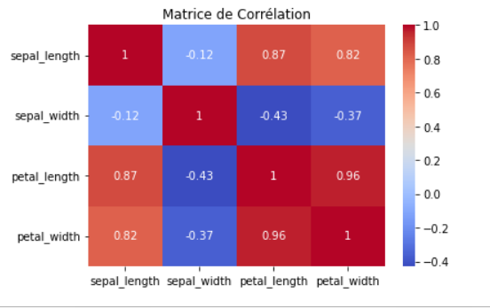

**Attention :**
- une corrélation forte ne signifie pas nécessairement une relation causale
- ne détecte pas les relation non linéaires (par ex: si x proche de 0, y augmente)

 

[Retour à l'index](#recherche-et-documentation)
 

## Fonction de coût

Mesure de performance qui permet de savoir si le modèle est bien parametré :
| fonction|Valeur si le modèle est bon|
|--------------|-------------|
|de **fitness** (d'adaptation) | élevée|
| de **coût** | faible|

La **fonction de coût** quantifie l'**écart entre les prédictions du modèle et les valeurs réelles**.
L'objectif lors de l'entraînement est de minimiser cette fonction pour améliorer la précision du modèle.

Différents types de fonctions de coût existent selon le problème traité :

- [**Erreur quadratique moyenne (MSE)**](#regression-lineaire.md) pour les problèmes de **régression**
- **Entropie croisée** pour les problèmes de **classification**
- **Hinge loss** pour les **SVM (machines à vecteurs de support)**

[Formule MSE](formules.md#MSE)

Un modèle bien paramétré aura donc une fonction de coût faible et, inversement, une fonction de fitness élevée, indiquant une bonne capacité du modèle à généraliser sur des données non vues.

#### A noter
La fonction de coût MSE du modèle de regression linéaire est une **fonction convexe (en cloche)**
Elle à donc un minimum global , mais pas de minimum local
C'est aussi une fonction continue, sa pente ne varie jamais abruptement.
 

[Retour à l'index](#recherche-et-documentation)
 

## Régression

En mathématiques, la régression recouvre plusieurs méthodes d’analyse statistique permettant d’approcher une variable à partir d’autres qui lui sont corrélées.

#### **1. [Régression Linéaire](#regression-lineaire)**
- Suppose une relation linéaire entre les variables.  
- Exemple : Prédire le prix d’une maison en fonction de sa surface.

#### **2. Régression Polynomiale**
- Extension de la régression linéaire 
- permet de modéliser des relation non linéaires en attribuant des puissances aux variables indépendantes.
- Elle utilise plus de paramètres, ce qui la rend plus flexible, mais également plus sujette au surajustement (overfitting).

#### **3. Régression Logistique**  
- Pour des problèmes de **classification binaire** (oui/non, 0/1, vrai/faux).  
- La sortie est une probabilité, utilis une fonction logistique (sigmoïde).  
- Exemple : Prédire si un email est spam ou non.

**Variantes :**
- **Régression Logistique Multinomiale** : Pour plus de deux classes.  
- **Régression Logistique Ordinale** : Pour des classes ordonnées (ex : satisfaction client : "faible", "moyenne", "élevée").  

#### **4. Régression Ridge et Lasso**
- **Ridge Regression** : Ajoute une pénalité sur les coefficients (régularisation L2) pour éviter le surapprentissage.  
- **Lasso Regression** : Régularisation L1 qui met certains coefficients à zéro (sélection de variables).  
- **ElasticNet** : Combinaison de Ridge et Lasso.

#### **5. Régression des Moindres Carrés Ponderés (WLS)**
- Variante de la régression linéaire où certaines observations ont plus de poids que d'autres.  
- Utilisée lorsque la variance des erreurs n'est pas constante (hétéroscédasticité).  

#### **6. Régression Quantile**
- Au lieu de prédire la moyenne des valeurs cibles, elle prédit un quantile donné (ex : médiane).  
- Utile lorsque les données contiennent beaucoup de valeurs extrêmes (outliers).  

#### **7. Régression Poisson**
- Utilisée lorsque la variable cible est un **compte** (nombre d'événements).  
- Exemple : Nombre de clients arrivant dans un magasin par heure.

#### **8. Régression Probit et Tobit**
- **Probit** : Alternative à la régression logistique pour des probabilités.  
- **Tobit** : Utilisée lorsque la variable cible est tronquée (ex : des salaires ne pouvant pas être négatifs).  

#### **9. Régression PLS (Partial Least Squares)**
- Variante de la régression linéaire utilisée quand les variables explicatives sont fortement corrélées.  

#### **10. Régression Support Vector Regression (SVR)**
- Basée sur les **machines à vecteurs de support (SVM)**.  
- Gère bien les données non linéaires et les valeurs aberrantes.  

#### **11. Régression avec Réseaux de Neurones (NN)**
- Utilise des architectures de deep learning pour modéliser des relations complexes.  
- Exemple : Réseaux de neurones profonds pour la prévision boursière.  

#### **12. Régression Bayésienne**
- Intègre une approche probabiliste et des distributions de probabilité sur les paramètres du modèle.  
- Exemple : Utilisé en médecine pour estimer des risques individuels.  

|||
|-|-| 
|**Données continues** | Régression linéaire, polynomiale, Ridge, Lasso, PLS, SVR, NN, Bayésienne| 
|**Données discrètes (comptage)** | Régression Poisson|
|**Classification binaire/multiclasse** | Régression logistique, probit|  
|**Données avec outliers** | Régression quantile|  
|**Corrélation entre variables explicatives** | Régression PLS, Ridge|  

#### Régression linéaire  {#regression-lineaire}

[notebook regression_lineaire](regression.ipynb)

Modélisation  par une droite de la **relation** entre une/des **variables indépendantes X** en entrée, et une **variable dépendante y** en sortie.

Le modèle linéaire effectue une **prédiction `y`** en calculant une somme pondérée de variables d'entrée `X` et ajoute un **terme constant (intercept) $\theta_0$** sans pondération

`y` est une combinaison linéaire des features `X` et d'un terme d'erreur qui introduit des imprécisions ou de la variabilité.

||forme scalaire|forme de somme pondérée|
|-|:--:|:--:|
|$\hat{y} = $|$\theta_1 x_1 + \dots + \theta_n x_n + \theta_0$|$\sum_{i=0}^{n} \theta_i x_i$|

 

|symbole|signification|
|:--:|:--:|
|$\hat{y}$ | valeur prédite|
|$n$ | nombre de variables|
|$\theta_i$ | paramètre du modèle, coefficient|
|$x_i$ | variable explicative|
|$\theta_0$|	Biais/intercept/constante qui n'est pas pondérée   Valeur de `y` lorsque toutes les variables $𝑥_𝑖$ sont égales à zéro|

Peut aussi s'écrire sous forme [vectorielle ou matricielle](regression_lineaire.md)

 

[Retour à l'index](#recherche-et-documentation)
 

## Descente de gradient

La descente de gradient (*Gradient Descent*) est une méthode d'entraînement utilisée pour optimiser les modèles de **régression linéaire** et d'autres algorithmes d'apprentissage automatique.  

#### **Principe : Correction progressive des paramètres**  
L'objectif est de mettre à jour les paramètres \( \theta \) du modèle afin de **réduire la valeur de la fonction coût** sur le jeu d'entraînement.  
Pour ce faire, on ajuste progressivement et simultanément les paramètres en **suivant la direction opposée au gradient** de la fonction coût.  

Il existe plusieurs types de descente de gradient : 
<ul>
<li><strong>batch (Batch Gradient Descent)</strong> mise à jour des paramètres après avoir calculé le gradient sur **l’ensemble** des données d'entraînement.</li>
<li><strong>par mini-lots (Mini-Batch Gradient Descent)</strong>  mise à jour après calcul du gradient sur un **sous-ensemble** aléatoire (mini-lot) de données.</li>
<li><strong>stochastique (Stochastic Gradient Descent, SGD)</strong>  mise à jour après chaque **exemple individuel**, ce qui introduit plus de bruit mais peut accélérer l’apprentissage.</li>
</ul>  

 

Calcule le gradient de la fonction coût au point $\theta$
Met à jour les paramètres en **se déplaçant dans la direction opposée au gradient** pour minimiser cette fonction.

**Le gradient** est une dérivée partielle de la fonction coût par rapport aux paramètres $\theta$, indiquant la direction de la plus forte augmentation.

**vecteur gradient** : lorsqu'il y a plusieurs paramètres
on calcule la **dérivée partielle** de la fonction coût de chaque paramètre.
On appelle ces dérivées des gradients

**La descente de gradient** calcule le gradient de la fonction coût au point $\theta_i$, puis progresse dans la direction opposée au gradient.

Pour minimiser la fonction coût, on se déplace dans la direction opposée au gradient.

- **Gradient** : c'est la **dérivée partielle** de la fonction coût par rapport à un paramètre \( \theta \), indiquant la **direction de la plus forte augmentation**.  
- **Vecteur gradient** : lorsque plusieurs paramètres sont présents, la fonction coût dépend de plusieurs variables.  
  - On calcule alors les **dérivées partielles** de la fonction coût pour chaque paramètre.  
  - L’ensemble de ces dérivées forme un **vecteur gradient**, qui est utilisé pour ajuster tous les paramètres simultanément.  

---
### **Étapes de la descente de gradient** :
1. Calcul du **gradient de la fonction coût** au point $\theta$, choisi initialement (souvent aléatoirement).  
2. progression en direction du gradient descendant en fonction du pas : hyperparamètre `learning_rate`
Mise à jour des paramètres en suivant la règle : 

   $$\theta \leftarrow \theta - \text{learning rate} \times \nabla J(\theta)$$

  |||
  |-|-|
  |$\nabla J(\theta)$ |gradient de la fonction coût |
  |`learning_rate` | **hyperparamètre** qui contrôle la vitesse d'apprentissage.|

3. Répétition du processus jusqu'à convergence,  **lorsque la variation de la fonction coût devient négligeable** ou qu'un nombre maximal d'itérations est atteint.
 ---

### Exemple d'une descente de gradient
- Pour une descente de gradient appliquée à une fonction de type **y = aX + b**
- **Fonction de coût :**
Le résiduel est la différence entre la valeur réelle (target) d'une observation et la valeur prédite par le modèle.
**SSR** = somme des résidus pour un modèle donné (c'est ce qu'on visualise ci-dessous). 

#### 1️⃣ Initialisation des paramètres  
- Choisir des valeurs initiales pour **a** et **b** (souvent aléatoires ou à zéro).  
- Définir un **taux d’apprentissage (learning rate)** qui contrôle la vitesse de mise à jour des paramètres.  

#### 2️⃣ Calcul des prédictions et de l'erreur   
- Pour chaque point de données (X, y), calculer la valeur prédite **ŷ = aX + b**. 
- Comparer chaque prédiction **ŷ** avec la valeur réelle **y**.  
- Calculer l’erreur (écart entre la prédiction et la vraie valeur). 

#### 3️⃣ Calcul des gradients  
- Déterminer **dans quelle direction** ajuster **a** et **b** pour réduire l’erreur.  
- Cela revient à mesurer l’impact d’une petite variation de **a** et **b** sur l’erreur globale.  

#### 4️⃣ Mise à jour des paramètres  
- Modifier **a** et **b** dans la direction qui réduit l’erreur, en fonction du taux d’apprentissage.  

#### 5️⃣  Répétition jusqu'à convergence  
- Répéter les étapes 2 à 5 jusqu’à ce que les mises à jour deviennent très petites (l’algorithme converge).  
- Si nécessaire, ajuster le **taux d’apprentissage** pour éviter des oscillations ou une descente trop lente.  

Après plusieurs itérations, **a** et **b** seront ajustés pour minimiser l’erreur, donnant la meilleure droite de régression possible.

### Exemple de descente de gradient

||fonction de type `y  = aX + b`|
|:-:|:-|
|`y`|prédiction - target|
|`a`|pente - slope - coefficient|
|`X`|vecteur des valeurs - feature|
|`b`| `intercept` - valeur `y` de la pente quand elle coupe l'axe des ordonnées y  (x = 0) |

#### Sur un seul paramètre - pour bien comprendre le fonctionnement

**Etapes :**
- On choisi la Sum of Square Residuals comme fonction de coût
- calcul la dérivée de la fonction de coût
- `intercept` = 0 comme valeur de départ
- calcul de la dérivé quand `intercept` = 0
- calcul du pas en conséquence
- calcul d'un nouvel `intercept`
- calcul de la dérivé avec le nouvel `intercept`
- bis répétita jusqu'à ce que la pas approche de 0

Si :
1. on connait la `pente` et l'`intercept`:
  - `a` = 0,64
  - `b` ou `intercept` = 0 ( choisis aléatoirement)
 
2. Alors, on peut tracer la ligne qui passe par `b` ou `intercept`, c'est à dire par `0` dans cet exemple
 
3. et donc calculer le `MSR` le carré des écarts entre les ordonnées `y`(target) des valeurs du jeux d'entrainement et les valeurs y de la ligne
**Mean Square Residuals** est une mesure intermédiaire qui guide l'optimisation.

  
4. Tracer sur un le graphe de droite le point de coordonnées :
  - en abscisse `x` : `intercept`  (donc 0, que l'on a choisi précédement)
  - en ordonnée `y` : `residual` (que l'on vient de calculer) 

|Graphe de gauche   Jeu d'entrainement|Graphe de droite   Mean Square Residuals|
|:--|:--|
|droite y = aX +b  `ordonnée` = `intercept`ou `b (pour x = 0)` = 0|`abscisse x` = `intercept` = 0   `ordonnée y` = somme des `residuals`|

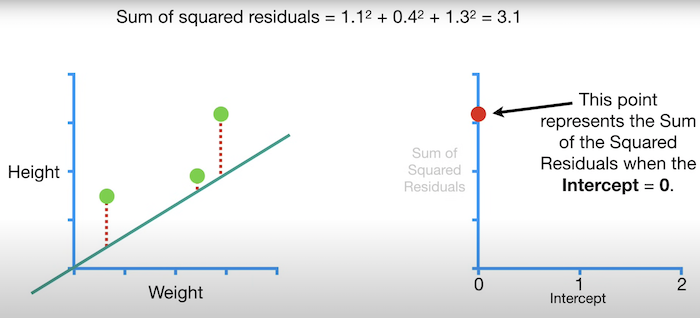

 
 

**On répète l'opération avec**
`pas` = `dérivée` * `learning_rate`
`nouveaux intercept` = `intercept` - `pas` = 0,25

|Jeu d'entrainement|Mean Square Residuals|
|:--|:--|
|droite y = aX +b  `ordonnée` = `intercept`ou `b (pour x = 0)` = 0.25|`abscisse x` = `intercept` = 0.25   `ordonnée y` = somme des `residuals`|

Graphe de gauche, `y` = 0.25 pour `x`= 0
Graphe de droite, `x` = 0.25, `y` = somme des `residual`
|||
|-|-|
|**`intercept`** = intersection de  la droite avec l'axe des ordonnées `y` pour `x` = 0|**`intercept` = 0,3**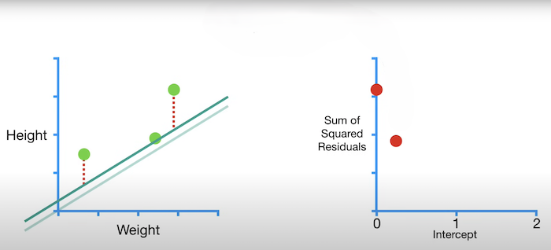|
|**`intercept` = 0,5**>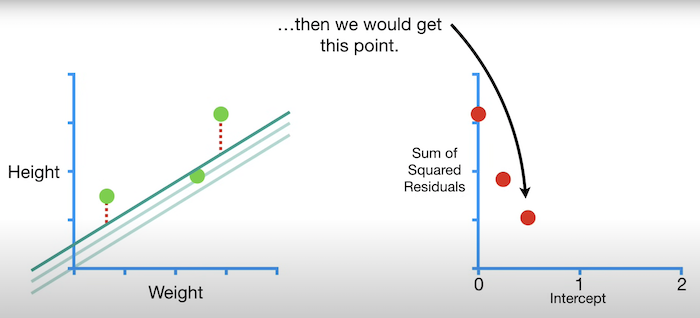|**`intercept` = 0,9** 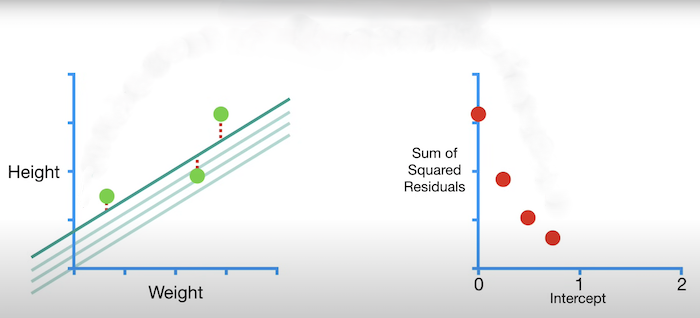|
|**`intercept` = 1**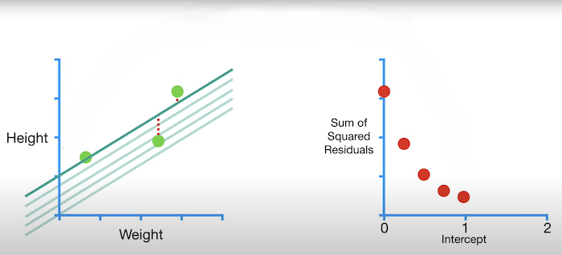|**`intercept` = 1,3** 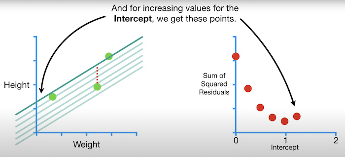|
|**`intercept` = 1,5**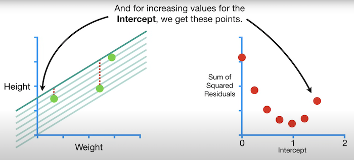|**`intercept` = 1,85**   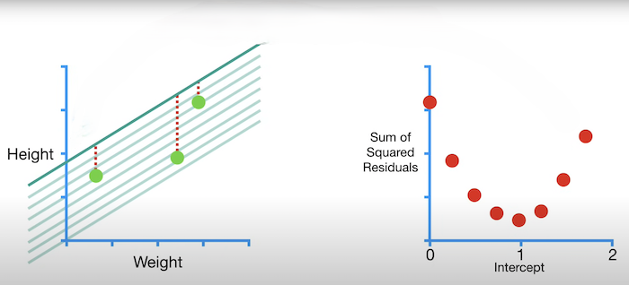|

### Sur tous les paramètres simultanément

En pratique, l'algorithme de descente de gradient modifie tous les paramètres à chaque itération
Exemple de descente de gradient sur 2 paramètres simultanément: `pente`et `intercept`
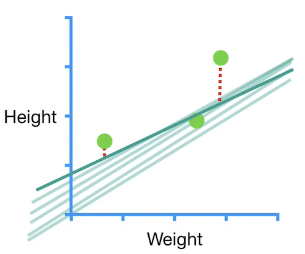

**Calcul de la taille du pas entre chaque itération :**
Le pas (ou taux de mise à jour) entre chaque itération dans la descente de gradient est influencé par la pente de la fonction de coût et le learning rate (taux d'apprentissage).

La pente de la descente de gradient, correspond à la dérivée partielle de la fonction de coût par rapport aux paramètres

**pas = pente de la dérivée de la descente de gradient * learning_rate**

**La pente de la fonction de coût est raide** (la dérivée est grande)
 un grand pas est nécessaire pour faire un grand ajustement.

**La pente est plate** (dérivée petite)
un petit pas est préférable pour éviter de trop ajuster le paramètre et risquer de diverger

**La decente de gradient s'arrête quand le pas (et la pente) s'approche de 0**
 
Différent pas d'une descente de gradient de fonction convexe (type fcnction MSE)

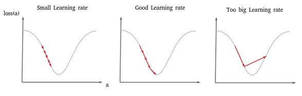

*La fonction de coût MSE est convexe, elle à donc un minimum global mais pas de minimum local, pas de variation abrupte de pente.*

Le pas pour la mise à jour des paramètres à chaque itération est calculé comme suit :
$$
\text{nouveau pas} = \text{pas actuel} - \text{learning rate} \times \frac{\partial \text{MSR}}{\partial \text{paramètre (ici intercept)}}$$

Quand la pente de la dérivé de la descente de gradient s'approche de 0, on s'approche d'un minimum

### Calcul de la dérivée partielle
À chaque itération de la descente de gradient :

1. **Calcul du carré des résidus**
calcule l'erreur pour chaque observation du jeu d'entraînement
On aditionne le carré de l'erreur de chaque observation

2. **Calcul de la Mean Square Residual (MSR)** : On fait la moyenne de ces carrés des résidus pour l'ensemble du jeu d'entraînement. ( la moyenne des erreurs quadratiques).

3. **Calcul des dérivées partielles** : Ensuite, on calcule les dérivées partielles de la **MSR** par rapport aux paramètres du modèle
Ces dérivées nous indiquent dans quelle direction et de combien chaque paramètre doit être ajusté pour minimiser l'erreur.
On ajuste simultanément tous les paramètres pendant chaque itération de la descente de gradient.

La dérivée partielle de la **MSR** par rapport à \(a\) ou \(b\) nous dit comment ajuster ces paramètres pour réduire l'erreur du modèle.

Ainsi, en calculant les dérivées partielles pour chaque paramètre, nous savons comment modifier progressivement les valeurs de \(a\) et \(b\) pour "descendre" le long de la pente du gradient et minimiser la **MSR**. Ce processus continue jusqu'à ce que l'erreur soit aussi faible que possible, indiquant que nous avons trouvé les paramètres optimaux pour le modèle.

 

Pour une descente de gradient, toutes les variables doivent avoir la même echelle, sinon la convergence sera plus lente

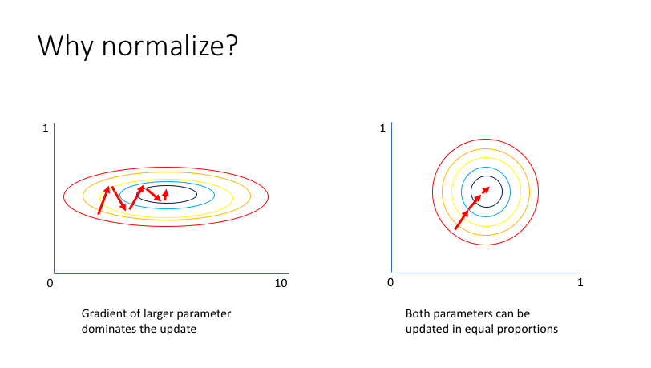

## Apprentissage profond

   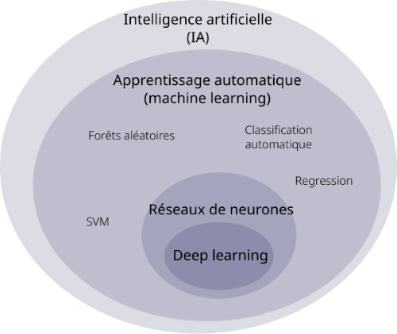

Procédé d’apprentissage automatique utilisant des [réseaux de neurones](./reseaux_neurones.md)

 composé de nombreuses couches cachées et des algorithmes avec de très nombreux paramètres.
Ce procédé requière une grande quantité de données afin d’être entraîné.

  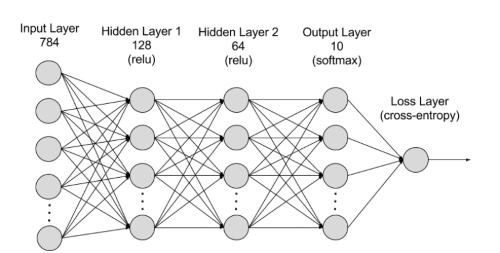

A permis des progrès importants et rapides :
- analyse du signal sonore, reconnaissance faciale
- analyse du signal visuel, reconnaissance vocale
- le traitement automatisé du langage

Le développement de l'apprentissage profond à été rendu possible par des investissements privés et publics importants, notamment de la part des GAFAM, durant les années 2000.
 

[Retour à l'index](#recherche-et-documentation)
 
