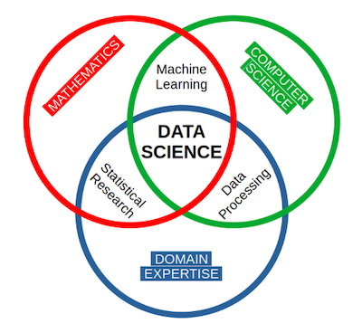

# what-is-machine-learning

Recherches, documentées, illustrées et sourcées des éléments suivants :

Définition des éléments de
veille ci-dessous.
Cette documentation se fera sous la forme de votre choix (Markdown, document PDF)

## A. La science des données

Ou comment générer du sens à partir de données.
Considérée comme un nom alternatif pour les statistiques dans les années 60, la science des données devient une discipline issue de l'informatique à la fin des années 90.
Elle s'articule autour de : 
- La conception.
- La collecte.
- L'analyse de données.

L'objet de cette science est l'étudie et l'analyse des données afin d'en extraire des informations pertinentes pour les entreprises.
Elle adopte une approche pluridisciplinaire, mêlant des concepts et des méthodes issus des mathématiques, des statistiques, de l'intelligence artificielle et de l'informatique. L'objectif est d'examiner de vastes ensembles de données pour répondre à des questions clés telles que : Que s'est-il passé ? Pourquoi cela s'est-il produit ? Que va-t-il se passer ? Et quelles actions peut-on entreprendre sur la base de ces résultats ?

4 formes d'analyse principale se dégagent :
1. **Analyse descriptive**
visualisation de données
2. **Analyse diagnostique**
exploration, transformation, corrélation...
3. **Analyse prédictive**
machine learning, la prédiction, la comparaison de modèles et la modélisation prédictive.
4. **Analyse prescriptive**
suite logique et proactive de l'analyse prédictive

## B. Apprentissage automatique
L'art de programmer des ordinateurs de sorte qu'ils puissent apprendre à partir de données

On considère qu'un ordinateur "apprend" s'il améliore sa **performance** lors de l'exécution d'une **tâche** au fur et à mesure de son **expérience**.

##  Apprentissage profond

Procédé d’apprentissage automatique utilisant des [réseaux de neurones](reseaux_neurone.md) composé de nombreuses couches cachées et des algorithmes avec de très nombreux paramètres.
Ce procédé requière une grande quantité de données afin d’être entraîné.

A permis des progrès importants et rapides :
- analyse du signal sonore, reconnaissance faciale
- analyse du signal visuel, reconnaissance vocale
- le traitement automatisé du langage

Le développement de l'apprentissage profond à été rendu possible par des investissements privés et publics importants, notamment de la part des GAFAM, durant les années 2000.

## C. L’apprentissage supervisé,
## D. L’apprentissage non supervisé,
## E. La classification supervisée
## F. La classification non supervisée
## G. La régression
## H. La validation croisée
## I. Les données d’entraînement, les données de test et/ ou de validation
## J. Corrélation linéaire (de Pearson) entre deux variables
## K. Une fonction de coût
## L. La descente de gradient

contexte du projet :

