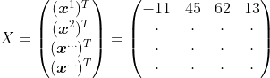
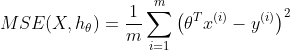
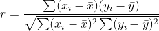

# Index

- [Mean Square Residuals](#mean-square-residuals)
- [MSE (Mean Squared Error)](#mse)
- [Dérivée partielle par rapport à un paramètre](#derivée-partielle-par-rapport-à-un-paramètre-theta_j)
- [Dérivée partielle](#derivée-partielle)
- [Vecteur Gradient du MSE](#vecteur-gradient-du-mse)
- [Coefficient de Pearson](#coefficient-de-pearson)

---
|symbole|signification|
|:--:|:--------|
|m|Nombre d'observation du jeu de donnée|
|$xi$|Vecteur  constitué des valeurs de des variables (hors étiquette) pour la ième observation|
|$X$ |Matrice contenant toutes les valeurs des toutes les variable (hors étiquette) du jeu de donnée|
|h|Hypothèse, fonction de prédiction|
|$\hat{y}$|y chapeau, valeur prédite, retournée par $h(x^i)$|
|T|Transposée|

En algèbre linéaire, par convention, un vecteur est généralement considéré comme un vecteur colonne.
|$\textbf{Vecteur } \boldsymbol{x}^i$|$\textbf{Transposée } (\boldsymbol{x}^i)^T$|
|:--:|:--------|
|||

Matrice $\boldsymbol{X}$, constituée de m vecteurs colonnes, chacun transposé en vecteur ligne

<!-- $$
X = 
\begin{pmatrix} (\boldsymbol{x}^1)^T \\ (\boldsymbol{x}^2)^T \\ (\boldsymbol{x}^{...})^T \\ (\boldsymbol{x}^{m})^T \end{pmatrix} =  
\begin{pmatrix} -11 & 45 & 62 & 13 \\ \cdot & \cdot & \cdot & \cdot \\ \cdot & \cdot & \cdot & \cdot \\ \cdot & \cdot & \cdot & \cdot  \end{pmatrix}
$$-->

### Mean Square Residuals - Résidu Quadratique Moyen
$$
MSR(\theta) = \frac{1}{m} \sum_{i=1}^{m} (\theta^T x^{(i)} - y^{(i)})^2
$$

$$
\begin{array}{|c|c|}
\hline
\textbf{Symbole} & \textbf{Signification} \\
\hline
m & \text{Nombre total d'exemples dans l'ensemble d'entraînement} \\
x^{(i)} & \text{Vecteur des caractéristiques de l'exemple } i \\
\theta & \text{Vecteur des paramètres du modèle} \\
\theta^T x^{(i)} \text{ ou } h (x^{(i)}) & \text{Prédiction du modèle pour } x^{(i)} \\
y^{(i)} & \text{Valeur réelle associée à } x^{(i)} \\
(\theta^T x^{(i)} - y^{(i)})^2 & \text{Erreur quadratique pour un exemple donné} \\
\hline
\end{array}
$$

### Mean Square Error - Erreure Quadratique moyenne
**Fonction de coût  pour le modèle de régression linéaire**

Voir la [fonction de coût](#regression-lineaire.md) du modèle de regression linéaire

Peut s'écrire de plusieurs manières : 
$MSE(X, h_\theta)$, pour montrer que le modèle est paramétré par le vecteur $\theta$ $MSE(X, h)$ 
$MSE(\theta)$ pour simplifier : 

<!--$$
MSE(X, h_\theta) = \frac{1}{m} \sum_{i=1}^{m} \left( \theta^T x^{(i)} - y^{(i)} \right)^2
$$-->

S'écrit aussi

$$J(\theta) = \frac{1}{m} \sum_{i=1}^{m} \left( h_\theta(x^{(i)}) - y^{(i)} \right)^2$$

|symbole|signification|
|:--:|:--------|
|$m$ | nombre total d'exemples dans l'ensemble d'entraînement.|
|$𝑥(𝑖)$  | vecteur des caractéristiques de l'exemple 𝑖|
|$𝜃$ | vecteur des paramètres du modèle.|
|$𝜃𝑇𝑥(𝑖)$ ou $h (x^{(i)})$ | prédiction du modèle pour $𝑥(𝑖)$|
|$y(i)$|valeur réelle associée à $𝑥_i$|
|$(\theta^T x^{(i)} - y^{(i)})^2$|erreur quadratique pour un exemple donné|

---
## Dérivée partielle par rapport à un paramètre $\theta_j$

$$\frac{\partial J(\theta)}{\partial \theta_j} = \frac{1}{m} \sum_{i=1}^{m} \left( h_\theta(x^{(i)}) - y^{(i)} \right) x_j^{(i)}$$

## Dérivée partielle
On note $ℎ𝜃(x^{(  i)})=𝜃^𝑇𝑥^{(𝑖)}$  
Donc la dérivée partielle du MSE par rapport à $\theta_j$  est :

$$
\frac{\partial MSE}{\partial \theta_j} = \frac{1}{m} \sum_{i=1}^{m}2 \left( \theta^T x^{(i)} - y^{(i)} \right) x_j^{(i)}
$$

Dérivée partielle par rapport à $\theta_j$ simplifiée

$$
\frac{\partial MSE}{\partial \theta_j} = \frac{2}{m} \sum_{i=1}^{m} \left( \theta^T x^{(i)} - y^{(i)} \right) x_j^{(i)}
$$

| Symbole               | Signification |
|-----------------------|--------------|
| $MSE(X, h_\theta) $  | Erreur quadratique moyenne (Mean Squared Error) |
| $\theta $        | Vecteur des paramètres du modèle |
| $\theta_j $      | $j $-ième paramètre du modèle |
| $\theta^T x^{(i)} $ | Produit scalaire entre $\theta $ et $x^{(i)} $, soit la prédiction du modèle |
| $m $            | Nombre total d'exemples d'entraînement |
| $x^{(i)} $      | Vecteur des caractéristiques de l'exemple $i $ |
| $x_j^{(i)} $    | $j $-ième caractéristique de l'exemple $i $ |
| $y^{(i)} $      | Valeur réelle de sortie pour l'exemple $i $ |
| $h_\theta(x^{(i)}) $ | Prédiction du modèle pour l'exemple $i $ (équivalent à $\theta^T x^{(i)} $) |
| $\alpha $      | Taux d'apprentissage (learning rate) |

---
### Vecteur Gradient du MSE

Pour calculer
**Vecteur Gradient du MSE**
$$
\nabla_\theta MSE = \frac{2}{m} X^T (X\theta - y)
$$

| Symbole                    | Signification |
|----------------------------|--------------|
| $\nabla_\theta MSE$      | Gradient du MSE (vecteur des dérivées partielles) |
| $X$                      | Matrice des caractéristiques de taille $ m \times n $ |
| $y$                      | Vecteur des valeurs réelles de taille $ m \times 1 $ |
| $\theta$                 | Vecteur des paramètres du modèle de taille $ n \times 1 $ |
| $X\theta$                | Prédictions du modèle (produit matriciel) de taille $ m \times 1 $ |
| $X^T$                    | Transposée de la matrice $ X $, de taille $ n \times m $ |
| $X^T (X\theta - y)$      | Gradient du MSE avant multiplication par $ \frac{2}{m} $ |
| $\alpha$                 | Taux d'apprentissage (learning rate) |

---

### coefficient de Pearson

​<!--$$r = \frac{\sum (x_i - \bar{x})(y_i - \bar{y})}{\sqrt{\sum (x_i - \bar{x})^2 \sum (y_i - \bar{y})^2}}$$-->

- **r** : le coefficient de corrélation linéaire de Pearson  
- **$x_i$** et **$y_i$** : les valeurs des deux variables étudiées  
- **$\bar{x}$** et **$\bar{y}$** : les moyennes des variables $x$ et $y$ 
- Le numérateur mesure la covariance entre $x$ et $y$ 
- Le dénominateur normalise cette covariance par le produit des écarts-types des deux variables  
 
[Retour à l'index](#index)
